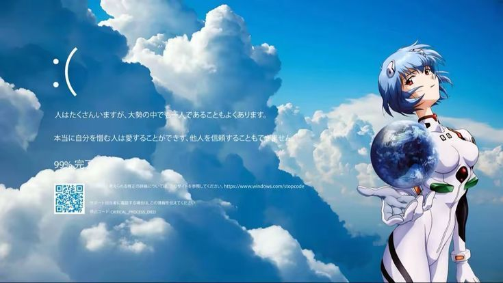

<div align="center">
  
</div>


## 🚀 Обо мне

- 🔥 **Full-Stack разработчик** с фокусом на Backend & DevOps
- ⚡ Специализируюсь на Node.js, NestJS, React, Angular
- 🌐 Мой личный сайт: [rualisher.uz](https://rualisher.uz/)
- 💻 Увлечен высокими технологиями, музыкой и аниме
- 🏆 Постоянно прокачиваю скиллы и осваиваю новые стеки

---

## 📈 GitHub Статистика


<p align="center">
      
      
      
      
      
      
      
      
</p>

---

## ⚙️ Codewars

<p align="center">
  
</p>

---

## 🛠 Технический стек

### 💻 Frontend


### ⚙️ Backend


### 🗄️ Databases


### 🚀 DevOps & Tools


---

## 💼 Специализация
```
┌─────────────┬─────────────┬─────────────┐
│   Backend   │   DevOps    │  Frontend   │
│     ███     │     ███     │     ███     │
│   Expert    │  Advanced   │  Advanced   │
└─────────────┴─────────────┴─────────────┘
           + UI/UX понимание
```

---

## ⚡ Интересные факты обо мне

**Сначала пушу в гит, потом грею рамен 🍜**  
_Приоритеты — как и должно быть._

**Я компилю баги во вкусный результат 🔥**  
_Потому что даже фейлы можно красиво подать._

---

## 🏆 Достижения

- 🚀 **100+ коммитов** за один день
- 💻 Создал и запустил **несколько продакшн-проектов**
- 🌐 Разработал и поддерживаю **[pro-platform](https://pro-platform.netlify.app/)**
- 🔧 Full-cycle разработка от идеи до деплоя

---

## 📬 Связь со мной

<p align="center">
  <a href="https://t.me/rual1sher">
    
  </a>
  <a href="https://rualisher.uz">
    
  </a>
</p>

---

<p align="center">
  
</p>
